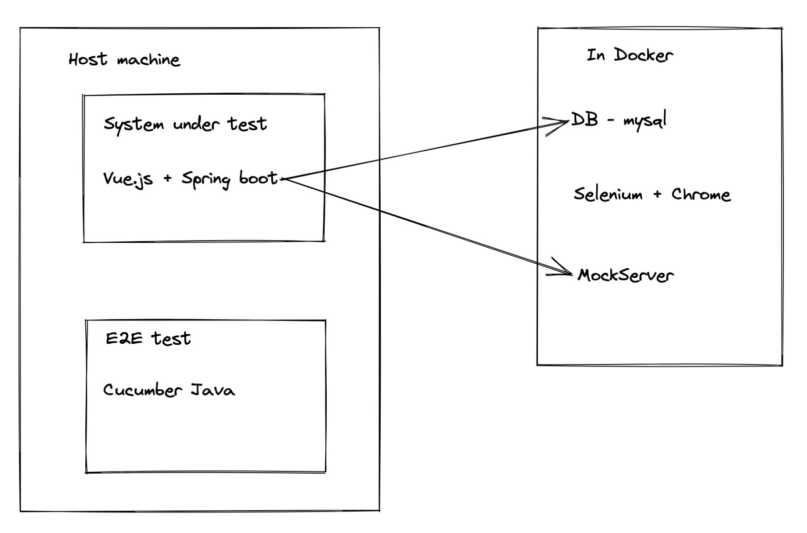

# Setup environment

For Windows, if you can't install Docker Desktop due to legal or policy reason, please
follow [this instruction](windows_without_docker_desktop.md) to setup environment

* Install docker and docker compose
* Please add the following host names into your hosts file

```ini
127.0.0.1 mysql.tool.net
127.0.0.1 mock-server.tool.net
127.0.0.1 web-driver.tool.net
```

* Start environment for running tests

```shell
cd env/compose/dc_pc
docker-compose up
```

After environment started, you should be able to access the chrome for running tests
at http://localhost:7900. Just click the connect button

Also, you can access the database at http://localhost:20000 with username `admin` and password `123456`. The database
name is `db`.

# Run the application

## For Linux and Mac

```shell
./gradlew bootRun
```

## For Windows

```shell
gradlew.bat bootRun
```

# Open the application

After run the application, you can open the application at http://localhost:10081

And, the swagger document is available at http://localhost:10081/swagger-ui/index.html

# Architecture


